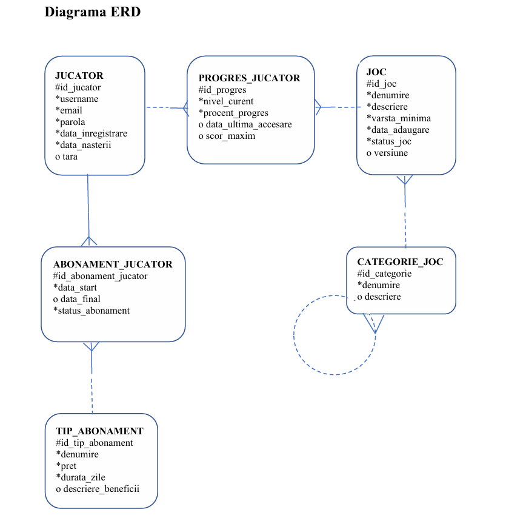

# Online Gaming Database
Database Systems project for an online gaming platform, including ERD, relational schema, SQL scripts and Oracle APEX implementation.

## Project Overview
This project models an online gaming platform database, including users, games, reviews, orders, payments and libraries.

## Contents
- Business scenario
- ERD diagram
- Mapping tables
- Normalized database schema
- SQL table creation scripts
- Constraints
- Sample data insertion
- Structure modifications
- Content modifications
- Database views

## Technologies
- Oracle Database
- Oracle SQL
- Oracle APEX
- Oracle Academy Environment (OAE)

## ERD Diagram

## Author
Anamaria-Rozalia Gherghel
